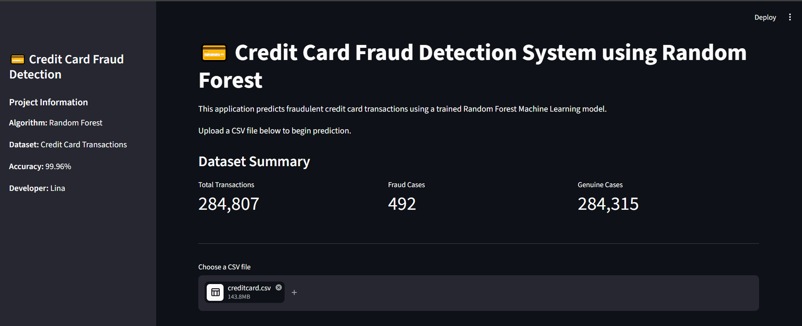
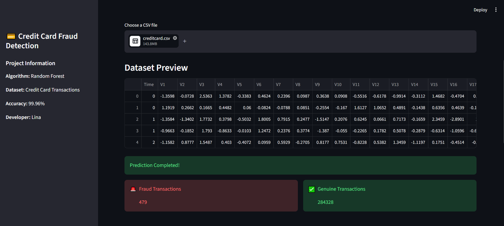
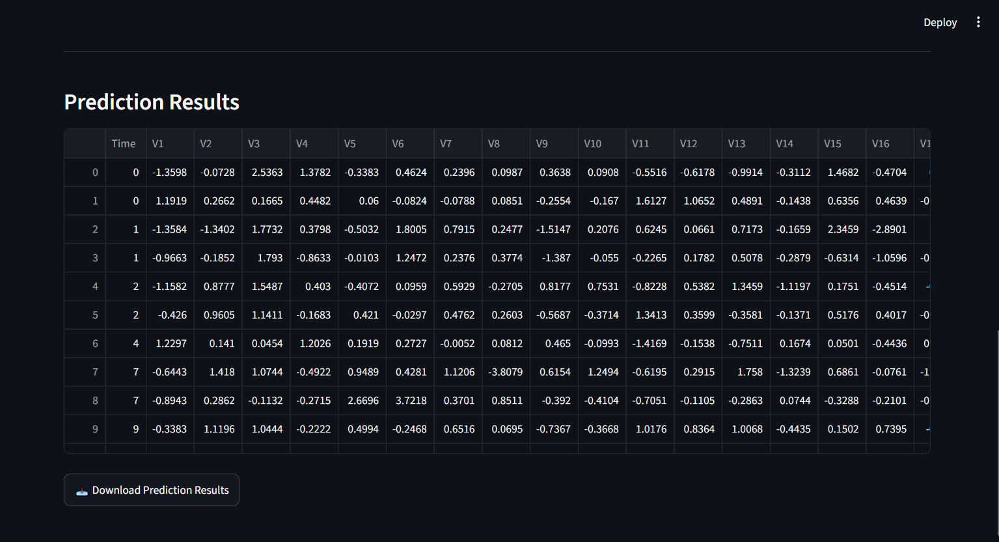
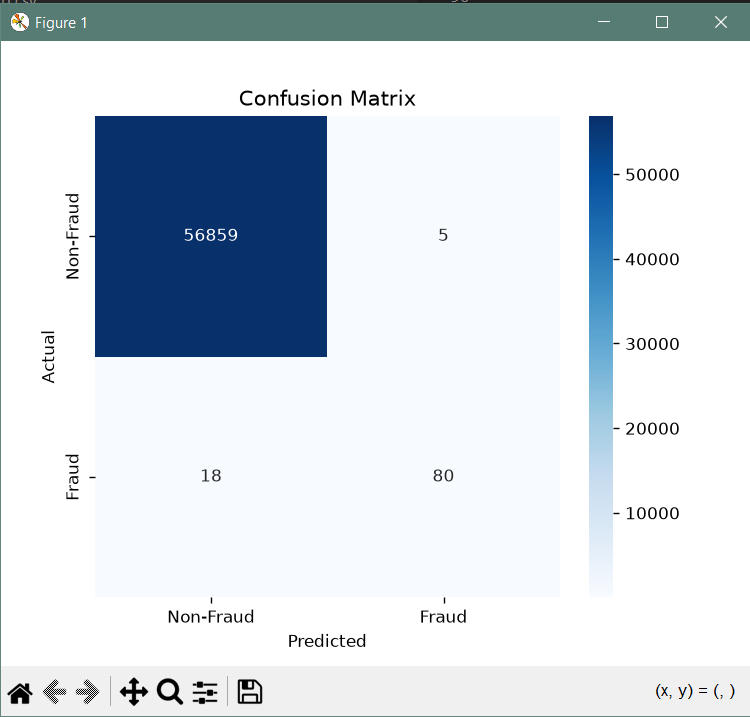
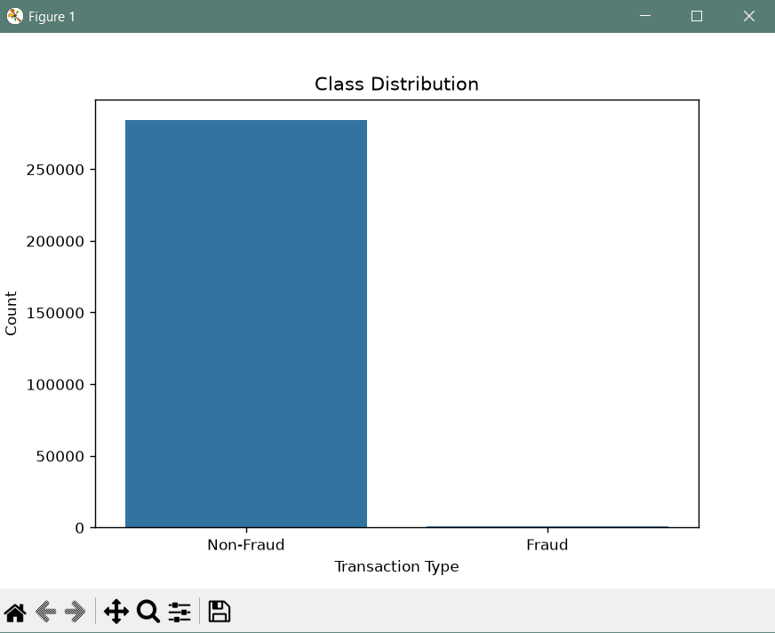
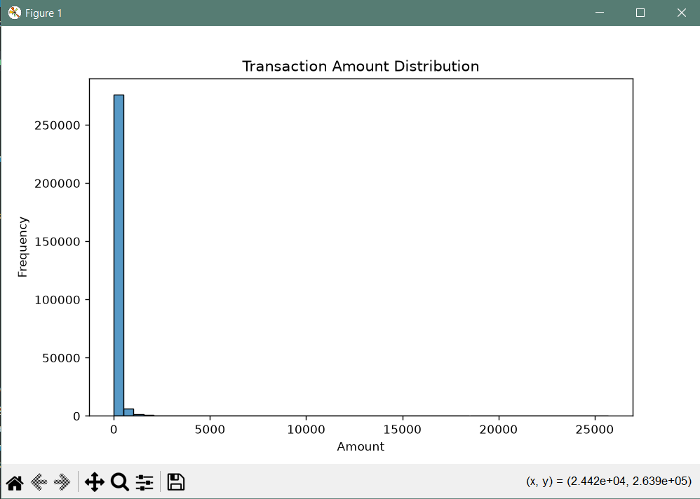
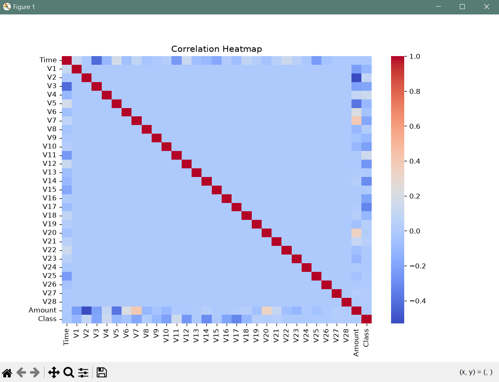

# 💳 Credit Card Fraud Detection using Machine Learning

A Machine Learning project that detects fraudulent credit card transactions using multiple classification algorithms. The project compares different models and deploys the best-performing model through a Streamlit web application.

---

## 📌 Features

- Data preprocessing
- Exploratory Data Analysis (EDA)
- Multiple Machine Learning models
  - Logistic Regression
  - Decision Tree
  - Random Forest
- Model comparison
- Model evaluation
- Confusion Matrix
- Streamlit web application
- CSV upload for prediction

---

## 🛠 Technologies Used

- Python
- Pandas
- NumPy
- Scikit-learn
- Matplotlib
- Seaborn
- Streamlit
- Joblib

---

## 📊 Model Performance

| Metric | Score |
|--------|-------|
| Accuracy | 99.96% |
| Precision | 94.12% |
| Recall | 81.63% |
| F1 Score | 87.43% |

Random Forest was selected as the final model.

---

## 📁 Project Structure

creditcard-fraud-detection/

├── dataset/

├── models/

├── src/

├── app.py

├── main.py

├── requirements.txt

└── README.md

---

## 🚀 How to Run

### Install dependencies

```bash
pip install -r requirements.txt
```

### Train the model

```bash
python main.py
```

### Launch the Streamlit app

```bash
streamlit run app.py
```

---

## 🖼️ Screenshots

### 🏠 Home Page



---

### 📂 Dataset Preview



---

### 📊 Prediction Results



---

### 🎯 Confusion Matrix



---

### 📈 Class Distribution



---

### 💰 Transaction Amount Distribution



---

### 🔥 Correlation Heatmap



## 👩‍💻 Developer

Lina